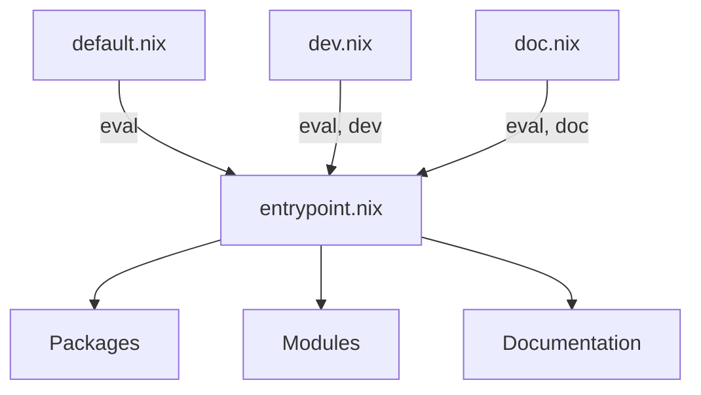

# Mana 💎

Mana solves dependency locking and injection

- Its only few lines of bash ⚡️ nix
- Its better than flakes

## Quickstart

```sh
nix run github:hsjobeki/mana init
nix run github:hsjobeki/mana update
```

Creates a lock.json that pins down all dependencies

Now you can build:

`nix build -f default.nix hello`

Done ⚡️

You should take a look at all files that exists. Before reading further

- `mana.nix`
- `entrypoint.nix`
- ...

> [!TIP]
> For ergonomics install it on your system
>
> e.g. `environment.systemPackages [ mana ]`

## Limitations

- Since this tool uses `fetchTree` - the fetcher inside flakes - it is limited to fetching sources that are supported by flakes.
- Currently verbose lockfile
- Requires the `importer.nix` shim. - When using flakes that is hidden inside nix.
- nix commands require `-f` flag / or a flake.nix compat shim (see [nix commands](#nix-commands) )

## Dev Dependencies

```nix
# mana.nix
{
  entrypoint = ./entrypoint.nix;

  dependencies = {
    nixpkgs.url = "github:nixos/nixpkgs";
    treefmt-nix.url = "github:numtide/treefmt-nix";
  };

  groups = {
    eval = {
      nixpkgs = [ ];
    };
    dev = {
      treefmt-nix = [ "eval" "dev" ];
    };
  };
}
```

`groups` control which dependencies are fetched. A dependency is only downloaded when it belongs to an enabled group. Without `groups`, everything goes into `eval` by default.

Here `nixpkgs` is in `eval` (always fetched), while `treefmt-nix` is in `dev` (only fetched when requested).

`default.nix` enables only `eval`. To also fetch dev dependencies:

```nix
# ci.nix
(import ./nix/importer.nix) { groups = [ "eval" "dev" ]; }
```

There is one `entrypoint.nix` for all groups. Disabled dependencies throw on access:

```nix
# entrypoint.nix
{ nixpkgs, treefmt-nix }:
{ system ? builtins.currentSystem }:
let
  pkgs = nixpkgs { inherit system; };
in
{
  packages.x = pkgs.callPackage ./. { };
  checks.formatting = pkgs.callPackage ./. { inherit treefmt-nix; };
}
```

Using `default.nix`: `treefmt-nix` throws when accessed.
Using `ci.nix`: `treefmt-nix` is available.



## Sharing Dependencies

By default, mana respects upstream manifests but re-locks all dependencies locally.

You often want to reduce nixpkgs downloads by forcing dependencies to use your pinned version.

### `share`

Use `share` to list dependencies that should be shared with all transitive dependencies:

```nix
# mana.nix
{
  entrypoint = ./entrypoint.nix;

  dependencies = {
    nixpkgs.url = "github:nixos/nixpkgs";
    treefmt-nix.url = "github:numtide/treefmt-nix";
  };

  # treefmt-nix (and any deeper deps) will use YOUR nixpkgs
  share = [ "nixpkgs" ];
}
```

This overrides nixpkgs in:

- treefmt-nix's dependencies
- Any transitive dependencies (dependencies of dependencies)
- **Does not** override your root-level nixpkgs

NOTE: `share` is syntactic sugar for [transitiveOverrides](#transitiveoverrides)

### Local Overrides

For granular control over specific dependencies, use local `overrides`:

```nix
# mana.nix
rec {
  entrypoint = ./entrypoint.nix;

  dependencies = {
    nixpkgs.url = "github:nixos/nixpkgs";
    treefmt-nix.url = "github:numtide/treefmt-nix";
    treefmt-nix.overrides = deps: deps // {
      nixpkgs = dependencies.nixpkgs;
    };
  };
}
```

### `transitiveOverrides`

For advanced cases, `transitiveOverrides` gives you a function over the full dependency set:

```nix
# mana.nix
rec {
  entrypoint = ./entrypoint.nix;

  dependencies = {
    nixpkgs.url = "github:nixos/nixpkgs";
    treefmt-nix.url = "github:numtide/treefmt-nix";
  };

  transitiveOverrides = deps: deps // {
    nixpkgs = dependencies.nixpkgs;
  };
}
```

`share = [ "nixpkgs" ]` is equivalent shorthand for the above.

If both `share` and `transitiveOverrides` are set, `share` is applied first, then `transitiveOverrides` on top.

### Override Precedence

Mana uses a two-level precedence system:

- At the root level (lenient mode):

  Local `overrides` win over `transitiveOverrides`/`share` (`overrides > transitiveOverrides`)
  Lets you customize immediate dependencies while setting defaults for the tree

- For all nested dependencies (strict mode):

  `transitiveOverrides`/`share` win over local `overrides`  (`transitiveOverrides > overrides`)
  Ensures your pins are enforced throughout the dependency tree

**Example**:

```nix
# Root mana.nix
rec {
  dependencies = {
    nixpkgs.url = "example:v25.05";
    utils.url = "example:v1.0";

    dep-a.url = "example:dep-a";
    dep-a.overrides = deps: deps // {
      nixpkgs.url = "example:v-unstable";  # ✓ Takes effect (root level is lenient)
    };
  };

  share = [ "nixpkgs" "utils" ];
}
```

```nix
# dep-a's mana.nix
{
  dependencies = {
    nixpkgs.url = "example:v-old";
    utils.url = "example:v-old";

    dep-b.url = "example:dep-b";
    dep-b.overrides = deps: deps // {
      nixpkgs.url = "example:v-unstable";  # ✗ Ignored (strict mode)
      utils.url = "example:v2.0";          # ✗ Ignored (strict mode)
    };
  };
}
```

Results:

- Root's `nixpkgs` → `example:v25.05` (root's own dependency)
- Root's `dep-a` gets `nixpkgs` → `example:v-unstable` (local override at root, lenient)
- `dep-a.dep-b` gets `nixpkgs` → `example:v25.05` (root's share enforced, strict)
- `dep-a.dep-b` gets `utils` → `example:v1.0` (root's share enforced, strict)

## Custom Entrypoints & Raw sources

By default, mana imports each dependency's `entrypoint` (from its `mana.nix`) or falls back to `default.nix`. You can override this per-dependency:

### Raw source (no import)

`entrypoint = null` disables the import

```nix
{
  dependencies = {
    nixpkgs.url = "github:nixos/nixpkgs";
    nixpkgs.entrypoint = null;  # raw source path
  };
}
```

```nix
# entrypoint.nix
{ nixpkgs }:
let
  pkgs = import nixpkgs { system = "x86_64-linux"; };
in
pkgs.hello
```

### Custom file

Use `entrypoint = "./path/to/file.nix"` to import a specific file instead of the default:

```nix
{
  dependencies = {
    some-lib.url = "github:someone/some-lib";
    some-lib.entrypoint = "./lib/special.nix";
  };
}
```

## nix-commands

Often we want our tools to be runnable / buildable by people just entering `nix build` or `nix run`.
These experimental commands are only natively compatible with flakes. - They require a `flake.nix` -
When using other files they require passing `-f <filename> attrName`

One possible way to get a more native experience is to create a `flake.nix` shim that re-exposes your runnable packages.

```nix
# flake.nix
# shim for nix run compat
{
  outputs =
    _:
    let
      systems = [
        "aarch64-linux"
        "x86_64-linux"

        "x86_64-darwin"
        "aarch64-darwin"
      ];
    in
    {
      packages = builtins.listToAttrs (
        map (system: {
          name = system;
          value =
            let
              self = import ./default.nix { inherit system; };
            in
            self
            // {
              # The default package
              # for 'nix run'
              default = self.hello-world;
            };
        }) systems
      );
    };
}
```

---
