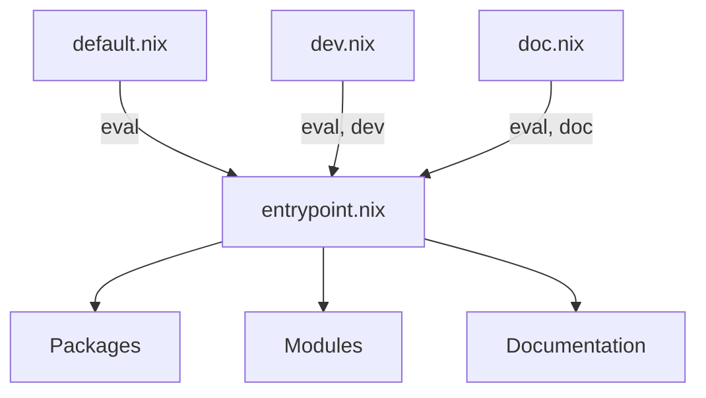

# Mana 💎

Mana locks and injects Nix dependencies without flakes.

- A few lines of Nix ⚡️ bash
- No flake dependency

## Quickstart

```sh
nix run github:hsjobeki/mana init
nix run github:hsjobeki/mana update
```

This creates a `lock.json` that pins all dependencies. Build with:

```sh
nix build -f default.nix hello
```

`mana init` generates four files:

- `mana.nix` — the manifest (dependencies, shares, pins, groups)
- `entrypoint.nix` — receives injected dependencies
- `default.nix` — evaluation entry point
- `nix/importer.nix` — runtime shim that wires everything together

## Limitations

- `fetchTree` (the fetcher inside flakes) limits sources to those flakes supports.
- Verbose lockfile format.
- Requires the `importer.nix` shim. Flakes hides this internally.
- Nix commands require the `-f` flag or a `flake.nix` compat shim (see [Nix commands](#nix-commands)).

## Commands

| Command | Description |
|---------|-------------|
| `mana init [--force]` | Initialize a new project (creates `mana.nix`, `entrypoint.nix`, `default.nix`, `nix/importer.nix`) |
| `mana update [dep1 dep2 ...]` | Update locked dependencies (all or specific ones) |
| `mana sync` | Sync `nix/importer.nix` with the current mana version (useful after upgrading) |

## Dev dependencies

```nix
# mana.nix
{
  name = "my-project";
  description = "My project using mana";

  entrypoint = ./entrypoint.nix;

  dependencies = {
    nixpkgs.url = "github:nixos/nixpkgs";
    treefmt-nix.url = "github:numtide/treefmt-nix";
  };

  groups = {
    eval = {
      nixpkgs = [ ];
    };
    dev = {
      treefmt-nix = [ ];
    };
  };
}
```

`groups` control which dependencies are fetched. A dependency is only downloaded when it belongs to an enabled group. Without `groups`, everything goes into `eval` by default.

Here `nixpkgs` is in `eval` (always fetched), while `treefmt-nix` is in `dev` (only fetched when requested).

`default.nix` enables only `eval`. To also fetch dev dependencies:

```nix
# ci.nix
(import ./nix/importer.nix) { groups = [ "eval" "dev" ]; }
```

One `entrypoint.nix` serves all groups. Disabled dependencies throw on access:

```nix
# entrypoint.nix
{ nixpkgs, treefmt-nix }:
{ system ? builtins.currentSystem }:
let
  pkgs = nixpkgs { inherit system; };
in
{
  packages.x = pkgs.callPackage ./. { };
  checks.formatting = pkgs.callPackage ./. { inherit treefmt-nix; };
}
```

With `default.nix`: accessing `treefmt-nix` throws an error.
With `ci.nix`: `treefmt-nix` is available.



## Share dependencies

By default, mana respects upstream manifests but re-locks all dependencies locally.

You often want to reduce nixpkgs downloads by forcing dependencies to use your pinned version.

### `share`

`share` lists dependencies shared with all transitive dependencies:

```nix
# mana.nix
{
  name = "my-project";

  entrypoint = ./entrypoint.nix;

  dependencies = {
    nixpkgs.url = "github:nixos/nixpkgs";
    treefmt-nix.url = "github:numtide/treefmt-nix";
  };

  # treefmt-nix (and any deeper deps) will use YOUR nixpkgs
  share = [ "nixpkgs" ];
}
```

This overrides `nixpkgs` in:

- treefmt-nix's dependencies
- Any transitive dependencies (dependencies of dependencies)

It does **not** override your root-level nixpkgs.

### `pins`

`pins` protects specific dependencies from being overridden by parent `share` declarations:

```nix
# mana.nix for a library that needs its own specific nixpkgs
{
  name = "my-library";

  entrypoint = ./entrypoint.nix;

  dependencies = {
    nixpkgs.url = "github:nixos/nixpkgs/nixos-24.11";
  };

  # Even if a consumer shares nixpkgs, this library keeps its own version
  pins = [ "nixpkgs" ];
}
```

When a dependency declares `pins`, those pinned dependencies are immune to `share` overrides from parent projects. This is useful for libraries that depend on a specific version for correctness.

## Custom Overrides

comming soon!

## Custom entrypoints and raw sources

By default, mana imports each dependency's `entrypoint` (from its `mana.nix`) or falls back to `default.nix`. You can override this per-dependency.

### Raw source (no import)

Set `entrypoint = null` to disable the import:

```nix
{
  dependencies = {
    nixpkgs.url = "github:nixos/nixpkgs";
    nixpkgs.entrypoint = null;  # raw source path
  };
}
```

```nix
# entrypoint.nix
{ nixpkgs }:
let
  pkgs = import nixpkgs { system = "x86_64-linux"; };
in
pkgs.hello
```

### Custom file

Set `entrypoint` to a path to import a specific file instead of the default:

```nix
{
  dependencies = {
    some-lib.url = "github:someone/some-lib";
    some-lib.entrypoint = "./lib/special.nix";
  };
}
```

## Nix commands

Experimental nix commands (`nix build`, `nix run`) only work natively with flakes. They require a `flake.nix`. With other files, you must pass `-f <filename> attrName`.

To get native `nix run` support, create a `flake.nix` shim that re-exposes your packages:

```nix
# flake.nix
# shim for nix run compat
{
  outputs =
    _:
    let
      systems = [
        "aarch64-linux"
        "x86_64-linux"

        "x86_64-darwin"
        "aarch64-darwin"
      ];
    in
    {
      packages = builtins.listToAttrs (
        map (system: {
          name = system;
          value =
            let
              self = import ./default.nix { inherit system; };
            in
            self
            // {
              # The default package
              # for 'nix run'
              default = self.hello-world;
            };
        }) systems
      );
    };
}
```

## Flakes dependencies

Comming soon!

---

Cheers
