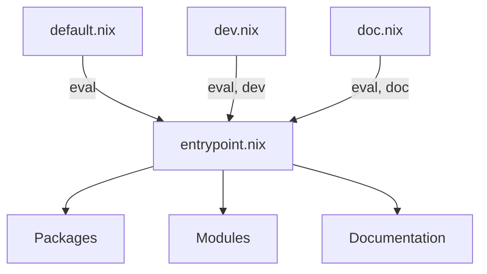

# Mana

Mana locks and injects Nix dependencies without flakes.

- Pure Nix + bash. No compiled dependencies.
- No flake required.

## Why mana?

[npins](https://github.com/andir/npins) and [lon](https://github.com/nikstur/lon) are flat source pinners. You pin each URL, import sources manually, and wire everything together yourself. They have no transitive dependency resolution.

Mana is a dependency manager:

| | npins / lon | flakes | mana |
|---|---|---|---|
| Transitive dependencies | ❌ Manual | ✅ | ✅ |
| Dependency injection | ❌ Manual wiring | ✅ `inputs` | ✅ entrypoints |
| Version sharing across tree | ❌ | ⚠️ `follows` | ✅ `shares` |
| Protect deps from overrides | ❌ | ❌ | ✅ `pins` |
| Dev dependencies | ❌ | ❌ | ✅ `groups` |
| Deduplication | ❌ | ✅ | ✅ |
| Implementation | Compiled Rust binary | Built into Nix | Pure Nix + shell script |

Mana has zero dependencies. It only needs `nix-instantiate` and `nix eval` -- tools already present on any system with Nix installed.

## Quickstart

```sh
nix run github:hsjobeki/mana init
nix run github:hsjobeki/mana update
```

This creates a `lock.json` that pins all dependencies.

```sh
nix build -f default.nix hello
```

`mana init` generates four files:

- `mana.nix` -- manifest (dependencies, shares, pins, groups)
- `entrypoint.nix` -- receives injected dependencies
- `default.nix` -- evaluation entry point
- `nix/importer.nix` -- shim that resolves and injects dependencies

## Commands

| Command | Description |
|---------|-------------|
| `mana init [--force]` | Create a new project |
| `mana update [dep1 dep2 ...]` | Update locked dependencies |
| `mana upgrade` | Upgrade `nix/importer.nix` to the current mana version |
| `mana check` | Validate `mana.nix` |

## Limitations

- `fetchTree` limits sources to what flakes support.
- Lockfile format is verbose.
- Requires the `importer.nix` shim. Flakes handle this internally.
- Nix commands need the `-f` flag or a `flake.nix` compat shim (see [Nix commands](#nix-commands)).

## Dev dependencies

```nix
# mana.nix
{
  name = "my-project";
  description = "My project using mana";

  entrypoint = ./entrypoint.nix;

  dependencies = {
    nixpkgs.url = "github:nixos/nixpkgs";
    treefmt-nix.url = "github:numtide/treefmt-nix";
  };

  groups = {
    eval = {
      nixpkgs = [ ];
    };
    dev = {
      treefmt-nix = [ ];
    };
  };
}
```

`groups` control which dependencies are fetched. A dependency is only fetched when it belongs to an enabled group. Without `groups`, everything defaults to `eval`.

Here `nixpkgs` is in `eval` (always fetched). `treefmt-nix` is in `dev` (fetched on request).

`default.nix` enables only `eval`. To include dev dependencies:

```nix
# ci.nix
(import ./nix/importer.nix) { groups = [ "eval" "dev" ]; }
```

One `entrypoint.nix` serves all groups. Disabled dependencies throw on access:

```nix
# entrypoint.nix
{ nixpkgs, treefmt-nix }:
{ system ? builtins.currentSystem }:
let
  pkgs = nixpkgs { inherit system; };
in
{
  packages.x = pkgs.callPackage ./. { };
  checks.formatting = pkgs.callPackage ./. { inherit treefmt-nix; };
}
```

With `default.nix`: accessing `treefmt-nix` throws an error.
With `ci.nix`: `treefmt-nix` is available.



## Share dependencies

Mana re-locks all dependencies locally by default. You often want all transitive deps to share a single `nixpkgs`. This avoids redundant downloads.

### `shares`

`shares` propagates your version of a dependency to the entire tree:

```nix
# mana.nix
{
  name = "my-project";

  entrypoint = ./entrypoint.nix;

  dependencies = {
    nixpkgs.url = "github:nixos/nixpkgs";
    treefmt-nix.url = "github:numtide/treefmt-nix";
  };

  # treefmt-nix (and any deeper deps) use YOUR nixpkgs
  shares = [ "nixpkgs" ];
}
```

This overrides `nixpkgs` in:

- treefmt-nix's dependencies
- All transitive dependencies (dependencies of dependencies)

It does **not** override your root-level `nixpkgs`.

### `pins`

`pins` protects a dependency from being overridden by a parent's `shares`:

```nix
# mana.nix for a library that needs its own nixpkgs
{
  name = "my-library";

  entrypoint = ./entrypoint.nix;

  dependencies = {
    nixpkgs.url = "github:nixos/nixpkgs/nixos-24.11";
  };

  # Keeps this version even if a consumer shares nixpkgs
  pins = [ "nixpkgs" ];
}
```

Pinned dependencies are immune to `shares` from parent projects. Use this for libraries that depend on a specific version for correctness.

## Custom overrides

Coming soon!

## Custom entrypoints and raw sources

By default, mana imports each dependency's entrypoint from its `mana.nix`. If none exists, it falls back to `default.nix`. You can override this per-dependency.

### Raw source (no import)

Set `entrypoint = null` to get the raw source path:

```nix
{
  dependencies = {
    nixpkgs.url = "github:nixos/nixpkgs";
    nixpkgs.entrypoint = null;  # raw source path
  };
}
```

```nix
# entrypoint.nix
{ nixpkgs }:
let
  pkgs = import nixpkgs { system = "x86_64-linux"; };
in
pkgs.hello
```

### Custom file

Set `entrypoint` to import a specific file:

```nix
{
  dependencies = {
    some-lib.url = "github:someone/some-lib";
    some-lib.entrypoint = "./lib/special.nix";
  };
}
```

## Debugging

Set `debug = true` in your root `mana.nix`:

```nix
# mana.nix
{
  name = "my-project";
  entrypoint = ./entrypoint.nix;
  debug = true;
  # ...
}
```

This traces the dependency tree during import:

```
trace: [mana] <root>
  groups: eval, dev
  deps: nixpkgs, treefmt-nix
trace: [mana] <root>/nixpkgs [raw]
trace: [mana] <root>/treefmt-nix [entrypoint: entrypoint.nix]
trace: [mana] /treefmt-nix
  groups: eval
  deps: nixpkgs
trace: [mana] /treefmt-nix/nixpkgs [raw]
```

Resolution types:

- `[raw]` -- `entrypoint = null`, returns the source path without importing
- `[custom: path]` -- parent overrides the entrypoint (`dependencies.foo.entrypoint = "path"`)
- `[entrypoint: path]` -- dependency's own entrypoint from its `mana.nix`
- `[default.nix]` -- no `mana.nix` found, falls back to `default.nix`

Only the root manifest's `debug` flag takes effect. `debug` in dependency manifests is ignored.

## Nix commands

`nix build` and `nix run` only work natively with flakes. Without a `flake.nix`, you must pass `-f <file> <attr>`.

To get `nix run` support, create a `flake.nix` shim:

```nix
# flake.nix
# shim for nix run compat
{
  outputs =
    _:
    let
      systems = [
        "aarch64-linux"
        "x86_64-linux"

        "x86_64-darwin"
        "aarch64-darwin"
      ];
    in
    {
      packages = builtins.listToAttrs (
        map (system: {
          name = system;
          value =
            let
              self = import ./default.nix { inherit system; };
            in
            self
            // {
              # The default package
              # for 'nix run'
              default = self.hello-world;
            };
        }) systems
      );
    };
}
```


## Flakes dependencies

Coming soon!

---

Cheers
